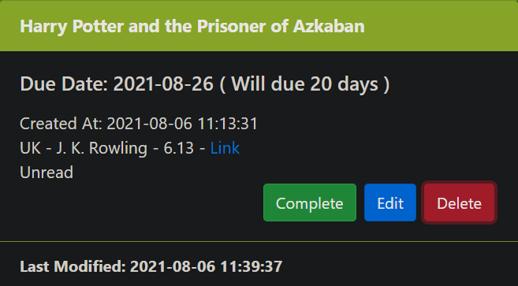
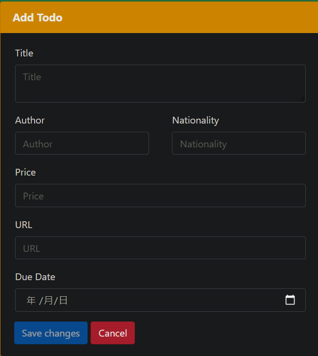
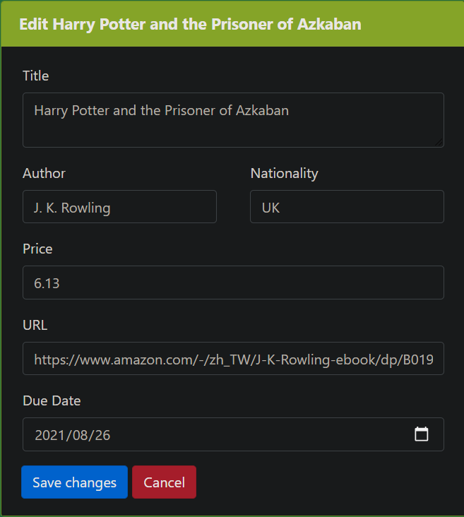
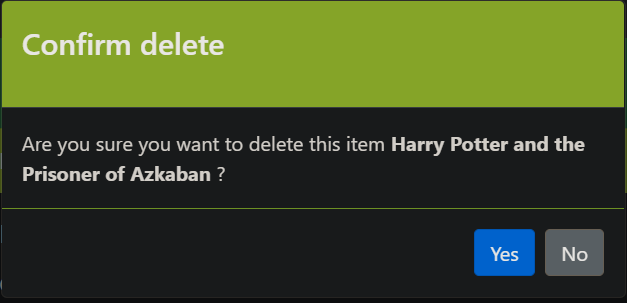
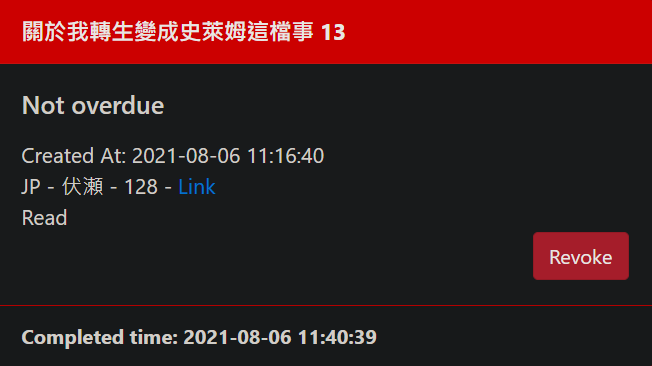
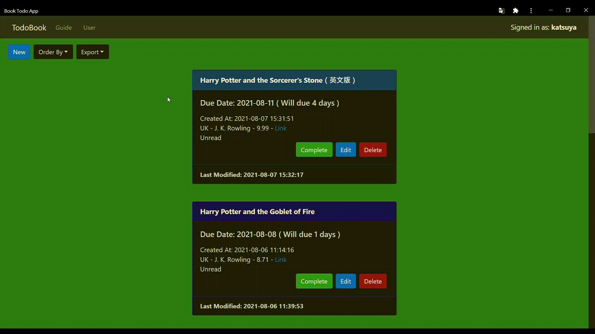
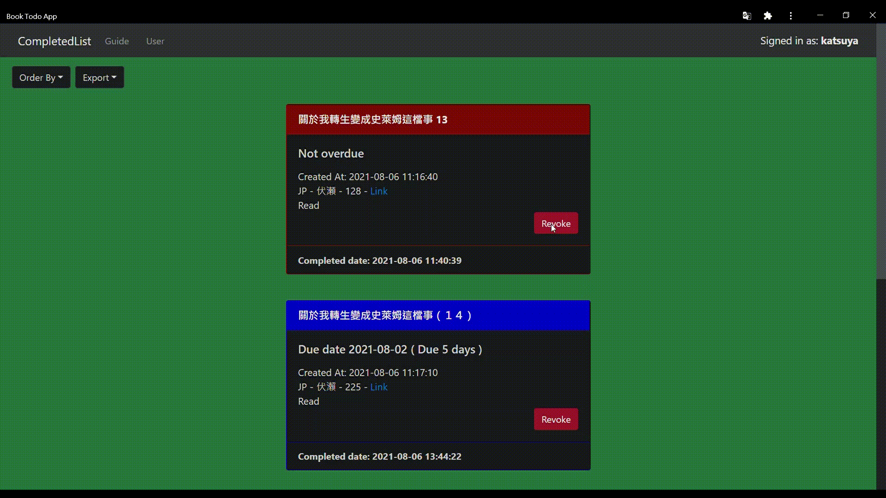

# Book Todo List: Ubuntu-Docker-React-Nginx-SSL-uWSGI-Django-Redis-MySQL
## 簡介
### Todolist 透過 [React](https://zh-hant.reactjs.org/) + [Nginx](https://nginx.org/en/) + [Django](https://www.djangoproject.com/) + [uWSGI](https://uwsgi-docs.readthedocs.io/en/latest/) + [Redis](https://redis.io/) + [MySQL](https://www.mysql.com/) 創建，透過 [Django REST framework](https://www.django-rest-framework.org/) 建構基本的 CRUD 操作，新增每日要閱讀的書
 

# React Book Todo UI Design
### Retrieve Book Todo

### Add Book Todo

### Edit Book Todo

### Confirm Delete Book Todo

### Revoke Book Todo

# Features
### Different accounts register and login

### Accounts forget password apply and reset password

### Different accounts CRUD Book Todo

### Sort todo list item

### Check and Revoke

## 2021-08-07 Add Export Todolist To CSV File
 

### Export Incomplete Todolist To CSV File

### Export Compelted Todolist To CSV File
